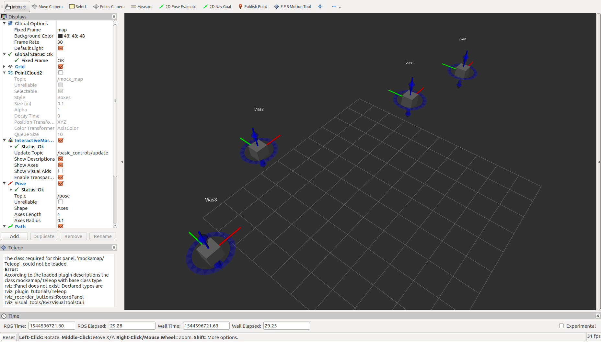
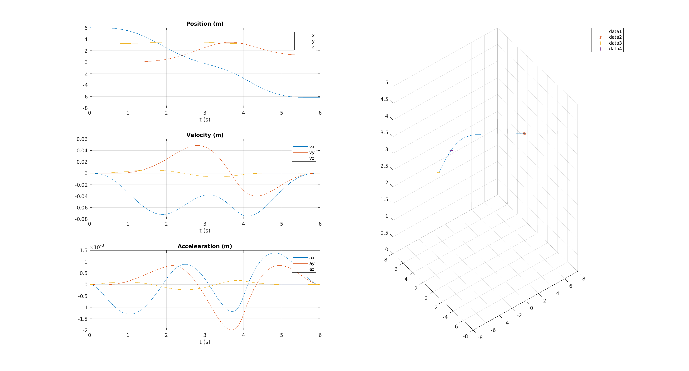
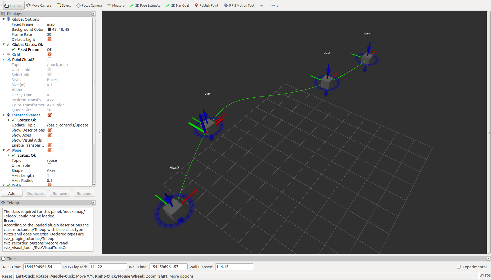

# Trajectory Generator by Unconstrained QP Method

## Before Start
- Install ROS Kinetic
- Install Matlab 2018a and **Robotic Tool Box**

## Step 1: Launch Rviz
Drag interactive marker to desired position.

## Step 2: Run generator on Matlab
Open *main.m* and run.
The matlab program will read marker position as a series of vias, and generate a continuous trajectory passing these vias.

## Step 3: Play generated trajectory on Rviz

### Reference
[1] D. Mellinger and V. Kumar. Minimum snap trajectory generation and control for quadrotors. In Proc. Int. Conf. on Robotics and Automation, 2011. 

[2] C. Richter, A. Bry and N. Roy, Polynomial Trajectory Planning for Aggressive Quadrotor Flight in Dense Indoor Envrionments. In Proc. Int. Symposium of Robotics Research(ISRR 2013).